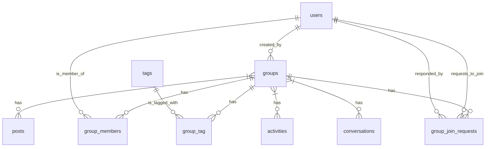

# Groups Feature - Database Schema Proposal

## 1. Table Definitions (SQL DDL)

### `groups` Table

```sql
CREATE TABLE groups (
    id UUID PRIMARY KEY DEFAULT gen_random_uuid(),
    name VARCHAR(100) NOT NULL,
    slug VARCHAR(120) UNIQUE NOT NULL,
    description TEXT,
    avatar_url VARCHAR(255),
    cover_image_url VARCHAR(255),
    privacy VARCHAR(20) NOT NULL DEFAULT 'public', -- 'public', 'private'
    auto_approve_members BOOLEAN DEFAULT FALSE,
    member_count INTEGER DEFAULT 0,
    created_by UUID NOT NULL,
    created_at TIMESTAMP WITH TIME ZONE DEFAULT NOW(),
    updated_at TIMESTAMP WITH TIME ZONE DEFAULT NOW(),
    deleted_at TIMESTAMP WITH TIME ZONE,

    CONSTRAINT fk_groups_created_by FOREIGN KEY (created_by) REFERENCES users(id) ON DELETE CASCADE
);
```

### `group_members` Table

```sql
CREATE TABLE group_members (
    id UUID PRIMARY KEY DEFAULT gen_random_uuid(),
    group_id UUID NOT NULL,
    user_id UUID NOT NULL,
    role VARCHAR(20) NOT NULL DEFAULT 'member', -- 'admin', 'member'
    joined_at TIMESTAMP WITH TIME ZONE DEFAULT NOW(),
    created_at TIMESTAMP WITH TIME ZONE DEFAULT NOW(),
    updated_at TIMESTAMP WITH TIME ZONE DEFAULT NOW(),

    CONSTRAINT fk_group_members_group_id FOREIGN KEY (group_id) REFERENCES groups(id) ON DELETE CASCADE,
    CONSTRAINT fk_group_members_user_id FOREIGN KEY (user_id) REFERENCES users(id) ON DELETE CASCADE,
    UNIQUE (group_id, user_id)
);
```

### `group_join_requests` Table

```sql
CREATE TABLE group_join_requests (
    id UUID PRIMARY KEY DEFAULT gen_random_uuid(),
    group_id UUID NOT NULL,
    user_id UUID NOT NULL,
    status VARCHAR(20) NOT NULL DEFAULT 'pending', -- 'pending', 'approved', 'denied'
    requested_at TIMESTAMP WITH TIME ZONE DEFAULT NOW(),
    responded_at TIMESTAMP WITH TIME ZONE,
    responded_by UUID,
    created_at TIMESTAMP WITH TIME ZONE DEFAULT NOW(),
    updated_at TIMESTAMP WITH TIME ZONE DEFAULT NOW(),

    CONSTRAINT fk_group_join_requests_group_id FOREIGN KEY (group_id) REFERENCES groups(id) ON DELETE CASCADE,
    CONSTRAINT fk_group_join_requests_user_id FOREIGN KEY (user_id) REFERENCES users(id) ON DELETE CASCADE,
    CONSTRAINT fk_group_join_requests_responded_by FOREIGN KEY (responded_by) REFERENCES users(id) ON DELETE SET NULL
);
```

### `group_tag` Pivot Table

```sql
CREATE TABLE group_tag (
    group_id UUID NOT NULL,
    tag_id UUID NOT NULL,
    created_at TIMESTAMP WITH TIME ZONE DEFAULT NOW(),

    PRIMARY KEY (group_id, tag_id),
    CONSTRAINT fk_group_tag_group_id FOREIGN KEY (group_id) REFERENCES groups(id) ON DELETE CASCADE,
    CONSTRAINT fk_group_tag_tag_id FOREIGN KEY (tag_id) REFERENCES tags(id) ON DELETE CASCADE
);
```

### Modifications to Existing Tables

#### `posts` Table

```sql
ALTER TABLE posts
ADD COLUMN group_id UUID;

ALTER TABLE posts
ADD CONSTRAINT fk_posts_group_id FOREIGN KEY (group_id) REFERENCES groups(id) ON DELETE CASCADE;
```

#### `activities` Table

```sql
ALTER TABLE activities
ADD COLUMN group_id UUID;

ALTER TABLE activities
ADD CONSTRAINT fk_activities_group_id FOREIGN KEY (group_id) REFERENCES groups(id) ON DELETE CASCADE;
```

#### `conversations` Table

```sql
-- First, ensure no existing 'group' type conversations if the enum is being modified.
-- If there are, they need to be handled (e.g., updated to a new type or deleted)
-- before the enum can be altered. For a new feature, this is unlikely to be an issue.

-- Add 'group' to the existing 'type' enum.
-- This is PostgreSQL specific.
DO $$ BEGIN
    IF NOT EXISTS (SELECT 1 FROM pg_type WHERE typname = 'conversation_type_enum') THEN
        -- If the enum type doesn't exist, create it with initial values
        CREATE TYPE conversation_type_enum AS ENUM ('private', 'activity', 'post', 'group');
        ALTER TABLE conversations ALTER COLUMN type TYPE conversation_type_enum USING type::conversation_type_enum;
    ELSE
        -- If the enum type exists, add 'group' to it
        ALTER TYPE conversation_type_enum ADD VALUE 'group' AFTER 'post';
    END IF;
END $$;

ALTER TABLE conversations
ADD COLUMN group_id UUID;

ALTER TABLE conversations
ADD CONSTRAINT fk_conversations_group_id FOREIGN KEY (group_id) REFERENCES groups(id) ON DELETE CASCADE;
```

## 2. Relationship Diagram (Mermaid)



## 3. Index Strategy Explanation

Indexes are crucial for query performance, especially in a social application with many relationships and filtering needs.

**New Tables:**

-   **`groups`**:
    -   `id`: Primary key, automatically indexed.
    -   `slug`: Unique index for efficient lookup and URL generation.
    -   `name`: Indexed for search functionality.
    -   `privacy`: Indexed for filtering groups by their privacy status.
    -   `created_by`: Indexed to quickly retrieve groups created by a specific user.
    -   `deleted_at`: Indexed to optimize queries involving soft-deleted groups.

-   **`group_members`**:
    -   `id`: Primary key, automatically indexed.
    -   `(group_id, user_id)`: Unique composite index to enforce that a user can only be a member of a group once. This also supports efficient lookups for specific user-group memberships.
    -   `user_id`: Indexed to quickly find all groups a user is a member of.
    -   `group_id`: Indexed to quickly retrieve all members of a specific group.

-   **`group_join_requests`**:
    -   `id`: Primary key, automatically indexed.
    -   `(group_id, user_id)`: A unique partial index where `status = 'pending'` to prevent duplicate pending requests from the same user to the same group.
    -   `group_id`: Indexed for efficient retrieval of join requests for a specific group (e.g., for an admin to review).
    -   `user_id`: Indexed to quickly find all join requests made by a specific user.
    -   `status`: Indexed for filtering requests by their current status.
    -   `responded_by`: Indexed to quickly find requests responded to by a specific admin.

-   **`group_tag`**:
    -   `(group_id, tag_id)`: Composite primary key, automatically indexed, ensuring uniqueness for group-tag associations and efficient lookups.
    -   `tag_id`: Indexed to quickly find all groups associated with a specific tag.

**Modified Tables:**

-   **`posts`**:
    -   `group_id`: Indexed to efficiently retrieve posts belonging to a specific group.

-   **`activities`**:
    -   `group_id`: Indexed to efficiently retrieve activities (events) belonging to a specific group.

-   **`conversations`**:
    -   `group_id`: Indexed to efficiently retrieve conversations associated with a specific group.

## 4. Migration Order and Dependencies

The migrations should be executed in an order that respects foreign key constraints.

1.  **Create `groups` table**: This is the foundational table for the Groups feature.
    -   `YYYY_MM_DD_HHMMSS_create_groups_table.php`
2.  **Create `group_members` table**: Depends on `groups` and `users` tables.
    -   `YYYY_MM_DD_HHMMSS_create_group_members_table.php`
3.  **Create `group_join_requests` table**: Depends on `groups` and `users` tables.
    -   `YYYY_MM_DD_HHMMSS_create_group_join_requests_table.php`
4.  **Create `group_tag` pivot table**: Depends on `groups` and `tags` tables.
    -   `YYYY_MM_DD_HHMMSS_create_group_tag_table.php`
5.  **Modify `posts` table**: Add `group_id` column and foreign key.
    -   `YYYY_MM_DD_HHMMSS_add_group_id_to_posts_table.php`
6.  **Modify `activities` table**: Add `group_id` column and foreign key.
    -   `YYYY_MM_DD_HHMMSS_add_group_id_to_activities_table.php`
7.  **Modify `conversations` table**: Add `group_id` column, foreign key, and update `type` enum.
    -   `YYYY_MM_DD_HHMMSS_add_group_id_to_conversations_table.php`

## 5. Deviations from ARCHITECTURE.md

There are no significant deviations from the `ARCHITECTURE.md` document. The proposed schema directly implements the table structures and modifications outlined in the architecture brief, including column types, constraints, and indexing strategies. The approach to modifying the `conversations` table's `type` enum is specifically tailored for PostgreSQL using a `DO $$ BEGIN ... END $$;` block to ensure it's handled correctly, as suggested in the brief.
