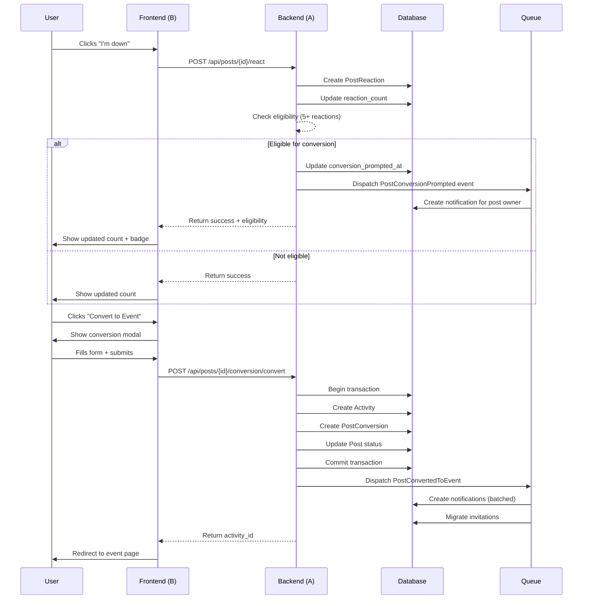

# Integration Guide: Post-to-Event Conversion

> **Purpose**: Coordinate work between Agent A (Backend) and Agent B (Frontend)  
> **Last Updated**: 2025-11-30

---

## Overview

This guide outlines how the backend and frontend components integrate to create a seamless post-to-event conversion experience.

---

## Integration Points

### 1. Event System Integration

#### Backend (Agent A)
**Events Dispatched**:
- `PostConversionPrompted` - When post reaches 5 or 10 reactions
- `PostConvertedToEvent` - When post is successfully converted
- `PostInvitationMigrated` - When post invitations are migrated to event

**Event Data Structure**:
```php
// PostConversionPrompted
[
    'post' => Post,
    'threshold' => 'soft' | 'strong'
]

// PostConvertedToEvent
[
    'post' => Post,
    'activity' => Activity,
    'conversion' => PostConversion
]
```

#### Frontend (Agent B)
**Event Listeners**:
```javascript
// Livewire events
Livewire.on('post-reacted', (data) => {
    // Refresh feed to show updated counts
});

Livewire.on('post-converted', (data) => {
    // Redirect to event page or refresh feed
});
```

**Browser Events**:
```javascript
window.addEventListener('open-conversion-modal', (event) => {
    // Open modal with postId
});
```

---

### 2. API Integration

#### Backend (Agent A)
**Endpoints Available**:
```
GET  /api/posts/{id}/conversion/eligibility
GET  /api/posts/{id}/conversion/preview
POST /api/posts/{id}/conversion/convert
POST /api/posts/{id}/conversion/dismiss-prompt
GET  /api/posts/{id}/interested-users/count
```

**Response Formats**:
```json
// Eligibility
{
    "should_prompt": true,
    "threshold": "soft",
    "reaction_count": 7
}

// Preview
{
    "interested_users_count": 12,
    "invited_users_count": 3,
    "total_potential_attendees": 15,
    "suggested_capacity": 18,
    "event_preview": { ... }
}

// Convert (Success)
{
    "success": true,
    "activity_id": "uuid",
    "message": "Post converted to event successfully"
}

// Convert (Error)
{
    "error": "Missing required field: start_time"
}
```

#### Frontend (Agent B)
**API Calls from Livewire**:
```php
// In ConvertPostModal.php
public function submit()
{
    $activity = app(PostService::class)->convertToEvent($this->postId, $eventData);
    // Handle response
}

// In NearbyFeed.php
public function dismissBanner(string $postId)
{
    app(PostService::class)->dismissConversionPrompt($postId);
}
```

---

### 3. Database Integration

#### Backend (Agent A)
**Tables Modified**:
- `posts` - Added conversion tracking columns
- `post_conversions` - Added notification tracking
- `post_reactions` - Added index for performance

**Model Scopes Available**:
```php
Post::eligibleForConversion()->get();
Post::notPrompted()->get();
Post::convertedPosts()->get();
```

**Model Helpers Available**:
```php
$post->isEligibleForConversion(); // bool
$post->hasReachedDismissLimit(); // bool
$post->shouldReprompt(); // bool
```

#### Frontend (Agent B)
**Using Model Helpers**:
```blade
@if($post->isEligibleForConversion())
    <x-conversion-badge :post="$post" />
@endif

@if($post->status === 'converted')
    <x-converted-post-overlay :post="$post" />
@endif
```

---

### 4. Notification Integration

#### Backend (Agent A)
**Notification Types Created**:
- `post_conversion_prompt` - Sent to post owner
- `post_converted_to_event` - Sent to interested users
- `post_invitation_converted` - Sent to invited users

**Notification Data Structure**:
```php
// post_conversion_prompt
[
    'post_id' => 'uuid',
    'post_title' => 'string',
    'reaction_count' => int,
    'threshold' => 'soft' | 'strong',
    'message' => 'string'
]

// post_converted_to_event
[
    'post_id' => 'uuid',
    'activity_id' => 'uuid',
    'activity_title' => 'string',
    'host_name' => 'string',
    'start_time' => 'ISO8601',
    'location' => 'string',
    'price' => float,
    'is_free' => bool,
    'attending_count' => int
]
```

#### Frontend (Agent B)
**Notification Components**:
```blade
{{-- In notifications list --}}
@if($notification->type === 'post_conversion_prompt')
    <x-notifications.conversion-prompt-card :notification="$notification" />
@endif

@if($notification->type === 'post_converted_to_event')
    <x-notifications.event-invitation-card :notification="$notification" />
@endif
```

---

## Workflow Integration

### Complete User Flow



---

## Testing Integration

### Shared Test Scenarios

Both agents should test these scenarios:

1. **Happy Path**: User reacts → prompt appears → converts → notifications sent
2. **Dismissal**: User dismisses prompt → re-prompt after 7 days
3. **Limit**: User dismisses 3 times → no more prompts
4. **Race Condition**: Multiple users react simultaneously → single prompt
5. **Transaction Rollback**: Conversion fails → no partial data
6. **Privacy**: Interested users not exposed by name
7. **Batching**: 50 interested users → 5 batches of 10

### Integration Test Checklist

- [ ] Backend events trigger frontend listeners
- [ ] Frontend API calls receive correct responses
- [ ] Database changes reflect in UI immediately
- [ ] Notifications appear in notification bell
- [ ] Conversion modal pre-fills correctly
- [ ] Event creation succeeds with valid data
- [ ] Event creation fails with invalid data
- [ ] Interested users receive notifications
- [ ] Invited users receive notifications
- [ ] Post status updates to "converted"
- [ ] Converted posts show event link
- [ ] Galaxy theme consistent throughout

---

## Coordination Schedule

### Daily Sync (15 minutes)

**Agenda**:
1. What did you complete yesterday?
2. What are you working on today?
3. Any blockers or integration issues?
4. Any API/event changes needed?

**Best Practices**:
- Communicate API changes immediately
- Test integration points daily
- Share test data/fixtures
- Document any deviations from plan

### Weekly Milestones

**Week 1**:
- Agent A: Migrations, services, events complete
- Agent B: Profile tab, post cards complete
- Integration: Test event system

**Week 2**:
- Agent A: Notifications, API endpoints complete
- Agent B: Conversion modal complete
- Integration: Test full conversion flow

**Week 3**:
- Both: Integration testing, bug fixes
- Both: UI/UX polish, accessibility

**Week 4**:
- Both: Analytics, monitoring
- Both: Production deployment prep

---

## Troubleshooting

### Common Issues

**Issue**: Frontend not receiving backend events
**Solution**: Check EventServiceProvider registration, verify event names match

**Issue**: API returns 401 Unauthorized
**Solution**: Verify auth:sanctum middleware, check user authentication

**Issue**: Conversion fails silently
**Solution**: Check Laravel logs, verify transaction rollback, check validation

**Issue**: Notifications not appearing
**Solution**: Check queue is running, verify notification type matches

**Issue**: Galaxy theme not applied
**Solution**: Check Tailwind classes, verify component extends galaxy-layout

---

## Contact Points

**Agent A (Backend)**: Responsible for API contracts, event structure, database schema
**Agent B (Frontend)**: Responsible for UI/UX, component structure, user flows

**Escalation**: If integration issue cannot be resolved, both agents should review this guide and the design document together.

---

*End of Integration Guide*

