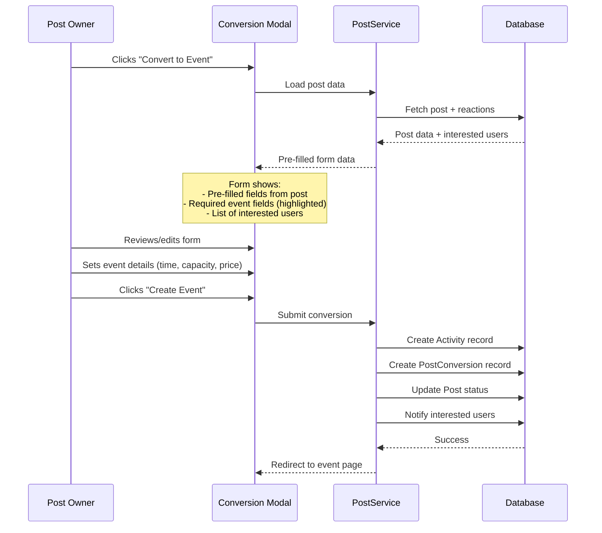
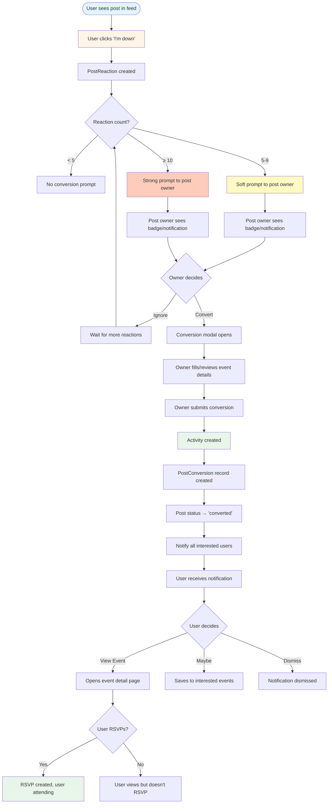

# Post-to-Event Conversion Workflow - Design Document

> **Status**: Design Phase - Awaiting Approval  
> **Created**: 2025-11-30  
> **Epic**: E03 (Activity Management) + E04 (Discovery Engine)

---

## Executive Summary

This document provides comprehensive design recommendations for the Post-to-Event conversion workflow, answering key UX, technical, and business logic questions. The design balances user engagement, discoverability, and conversion efficiency while maintaining consistency with existing FunLynk patterns.

---

## 1. User Interest Tracking ("Watch List")

### Question
When a user clicks "I'm down", where can they see a list of posts they've expressed interest in?

### Recommendation: **Option B - Add "Interested" Tab to Profile Page**

#### Rationale

**Why Profile Page (Option B) over Main Navigation (Option A):**

1. **Consistency with Existing Patterns**: The profile page already has a tab-based structure (Posts, Hosting, Attending). Adding an "Interested" tab maintains this established pattern.

2. **User Mental Model**: Users already understand the profile as their "activity hub" - what they've created (Posts), what they're hosting (Hosting), what they're attending (Attending). "Interested" fits naturally as "what I'm watching."

3. **Reduced Navigation Clutter**: The main navigation should remain focused on primary discovery actions (Home/Feed, Create, Notifications, Profile). Adding a miscellaneous dashboard would dilute this focus.

4. **Scalability**: If we later add more user-specific lists (e.g., "Saved", "Archived"), the profile tabs can accommodate them without overwhelming the main nav.

5. **Privacy Control**: Profile tabs can easily be made private (visible only to the owner), which makes sense for an "Interested" list.

#### Implementation Details

**Tab Specification**:
- **Label**: "Interested" 
- **Icon**: Heart or bookmark icon
- **Badge Count**: Number of active posts user has reacted to with "I'm down"
- **Color Theme**: Orange/amber (distinct from existing pink/purple/cyan)
- **Position**: 4th tab (after Posts, Hosting, Attending)

**Tab Content**:
- Display posts where `post_reactions.user_id = current_user AND reaction_type = 'im_down'`
- Filter to only show `posts.status = 'active'` (not expired)
- Sort by `post_reactions.created_at DESC` (most recently interested first)
- Show post card with:
  - Post title, description, location
  - Current reaction count
  - Time until expiration
  - "Converted to Event" badge if applicable
  - Quick action to remove interest (un-react)

**Empty State**:
- Message: "You haven't shown interest in any posts yet"
- CTA: "Explore nearby posts" → links to discovery feed

---

## 2. Post-to-Event Conversion Threshold

### Questions
- What determines when a post owner should be encouraged to convert?
- Should this be configurable or hard-coded?
- What UI patterns notify the post owner?

### Recommendations

#### Threshold Values

**Two-Tier System** (Hard-coded initially, configurable in admin later):

1. **Soft Threshold (5 reactions)**: "Suggestion" phase
   - Post owner sees a **subtle prompt** to consider converting
   - Not intrusive, just informative
   - Message: "🎉 5 people are interested! Consider creating an event."

2. **Strong Threshold (10 reactions)**: "Encouragement" phase
   - Post owner sees a **prominent call-to-action**
   - More urgent messaging
   - Message: "🔥 10+ people want to join! Turn this into an event now."

**Why This Approach**:
- **5 reactions** = Proof of concept. Enough interest to validate demand.
- **10 reactions** = Critical mass. Strong signal that this should be a formal event.
- **Hard-coded initially** = Simplifies MVP. We can A/B test and optimize later.
- **Admin configurable later** = Allows platform to adjust thresholds based on community size and engagement patterns.

#### UI Notification Patterns

**Multi-Channel Approach** (Layered notifications for maximum visibility):

##### 1. In-App Notification (Immediate)
- **Trigger**: When threshold is crossed
- **Type**: Real-time notification in notification bell
- **Content**: "Your post '[Post Title]' has reached [5/10] interested users! [Convert to Event]"
- **Action**: Click to open conversion modal

##### 2. Post Card Badge (Persistent)
- **Location**: On the post card itself (visible in profile "Posts" tab and anywhere the post appears)
- **Visual**: Animated gradient badge/banner at top of card
- **Soft Threshold (5)**: Yellow/amber badge - "🌟 Ready to Convert"
- **Strong Threshold (10)**: Pink/purple gradient badge - "🔥 Convert Now!"
- **Action**: Click badge to open conversion modal

##### 3. Feed Prompt (Contextual)
- **Location**: When post owner views their own post in the feed
- **Visual**: Inline banner above post card
- **Content**: "This post is getting attention! [X] people are interested. [Convert to Event]"
- **Dismissible**: Yes (but reappears on next session if not converted)

##### 4. Email Notification (Delayed - Optional)
- **Trigger**: 24 hours after reaching threshold (if not yet converted)
- **Content**: Summary of interest + conversion CTA
- **Frequency**: One-time per threshold (not spammy)

**Priority Order**: Notification Bell > Post Card Badge > Feed Prompt > Email

---

## 3. Conversion Process

### Questions
- One-click conversion or specialized form?
- What happens to the original post after conversion?

### Recommendations

#### Conversion Flow: **Hybrid Approach (Pre-filled Form with Review)**

**Why Not One-Click**:
- Posts are intentionally lightweight (title, description, location, time hint)
- Events require more structured data (exact start/end time, max attendees, pricing, images)
- Auto-converting without review could create incomplete or incorrect events

**Why Not Blank Form**:
- Forcing users to re-enter all data creates friction
- Defeats the purpose of "converting" (should feel like an upgrade, not starting over)

#### Step-by-Step Conversion Flow



#### Conversion Modal Specification

**Modal Title**: "Convert Post to Event"

**Pre-filled Fields** (from Post):
- ✅ Title (editable)
- ✅ Description (editable)
- ✅ Location (editable)
- ✅ Tags (editable)

**New Required Fields** (for Event):
- ⚠️ **Start Date/Time** (required - pre-filled from `approximate_time` if available)
- ⚠️ **End Date/Time** (required - defaults to +2 hours from start)
- ⚠️ **Max Attendees** (required - suggested: `reaction_count * 1.5` rounded up)
- ⚠️ **Pricing** (required - defaults to "Free")
- ⚠️ **Event Image** (optional - placeholder if not provided)

**Interested Users Preview**:
- Show avatars/names of users who clicked "I'm down"
- Message: "These [X] users will be notified when you create this event"
- Visual: Stacked avatar row (max 10 visible, "+X more" if exceeds)

**Actions**:
- **Primary CTA**: "Create Event" (gradient button)
- **Secondary**: "Cancel" (returns to post view)

#### Post Status After Conversion

**Recommended Approach**: **Archive with Badge (Hybrid)**

**What Happens**:
1. Post `status` changes from `active` to `converted`
2. Post remains visible but non-interactive
3. Post displays a prominent "Converted to Event" badge with link to the event
4. Post no longer appears in discovery feeds
5. Post still visible in:
   - Post owner's profile "Posts" tab (with converted badge)
   - Users' "Interested" tab (with link to event)

**Visual Treatment**:
- Overlay: Semi-transparent gradient overlay on post card
- Badge: "✨ Now an Event" with arrow icon
- CTA: "View Event" button (replaces "I'm down" button)
- Reactions: Frozen (shows count at time of conversion, no new reactions)

**Why This Approach**:
- **Maintains Context**: Users can see the journey from post → event
- **Preserves Social Proof**: Reaction count shows initial interest
- **Reduces Confusion**: Clear visual indicator that post is no longer active
- **Enables Analytics**: Can track conversion rates and success metrics

---

## 4. User Notification & RSVP After Conversion

### Questions
- Auto-RSVP or send invitation?
- What should the notification say?
- Should there be a time limit?

### Recommendation: **Option B - Send Invitation, Let Users Choose**

#### Rationale

**Why Not Auto-RSVP (Option A)**:
- **Consent Issue**: Clicking "I'm down" on a casual post ≠ committing to a formal event
- **Changed Details**: Event might have different time, location, or pricing than the original post
- **Spam Risk**: Users might feel forced into events they're no longer interested in
- **RSVP Inflation**: Auto-RSVPs would inflate attendance numbers with uncommitted users

**Why Invitation (Option B)**:
- **Respects User Agency**: Users can review event details before committing
- **Higher Quality RSVPs**: Only users who actively choose to attend will RSVP
- **Reduces No-Shows**: Intentional RSVPs lead to better attendance rates
- **Flexible Response**: Users can decline, maybe, or ignore without guilt

#### Notification Specification

**Notification Type**: `PostConvertedToEvent`

**Trigger**: Immediately after event is created from post

**Recipients**: All users where `post_reactions.post_id = converted_post AND reaction_type = 'im_down'`

**Notification Content**:

**Title**: "🎉 [Post Title] is now an event!"

**Body**: 
```
[Post Owner Name] created an event based on the post you were interested in.

📅 [Event Date/Time]
📍 [Event Location]
💵 [Free/Price]

[X] people are already attending. Will you join them?
```

**Actions**:
- **Primary CTA**: "View Event" (opens event detail page)
- **Secondary CTA**: "Maybe" (saves to user's "Interested" events)
- **Tertiary**: "Not Interested" (dismisses notification)

**Channels**:
1. **In-App Notification** (immediate, persistent until dismissed)
2. **Push Notification** (if user has enabled)
3. **Email** (optional, 1 hour delay to batch with other notifications)

#### Time Limit for Response

**Recommendation**: **Soft Deadline (Event-Dependent)**

**No Hard Expiration**:
- Notification persists until user dismisses or event passes
- Users can RSVP anytime before event capacity is reached
- No artificial urgency (reduces pressure, improves UX)

**Soft Urgency Indicators**:
- If event is \u003c 48 hours away: Add "⏰ Event starts soon!" to notification
- If event is 80% full: Add "🔥 Almost full! [X] spots left"
- If event is full: Change CTA to "Join Waitlist"

**Why No Hard Deadline**:
- Users might not check app immediately
- Creates unnecessary FOMO/pressure
- Event capacity is the natural deadline
- Allows for organic discovery (users might share with friends)

---

## 5. User Flow Diagram



---

## 6. Database & Model Changes

### New/Modified Tables

#### No New Tables Needed ✅
All required tables already exist:
- `posts` - source posts
- `post_reactions` - tracks "I'm down" clicks
- `activities` - destination events
- `post_conversions` - tracks conversion metadata
- `rsvps` - tracks event attendance
- `notifications` - handles all notifications

### Schema Modifications

#### 1. `posts` Table
**Add Column**:
```sql
ALTER TABLE posts 
ADD COLUMN conversion_prompted_at TIMESTAMP NULL,
ADD COLUMN conversion_dismissed_at TIMESTAMP NULL;
```

**Purpose**:
- `conversion_prompted_at`: Track when user first saw conversion prompt (for analytics)
- `conversion_dismissed_at`: Track if user explicitly dismissed prompt (don't re-prompt)

#### 2. `post_conversions` Table
**Add Columns**:
```sql
ALTER TABLE post_conversions
ADD COLUMN interested_users_notified INTEGER DEFAULT 0,
ADD COLUMN notification_sent_at TIMESTAMP NULL;
```

**Purpose**:
- `interested_users_notified`: Count of users who received conversion notification
- `notification_sent_at`: When notifications were sent (for analytics)

#### 3. `notifications` Table
**No changes needed** - existing structure supports all notification types

### Model Updates

#### PostService.php
**New Methods**:
```php
// Check if post is eligible for conversion prompt
public function shouldPromptConversion(string $postId): array

// Dismiss conversion prompt (user clicked "not now")
public function dismissConversionPrompt(string $postId): void

// Convert post to event
public function convertPostToEvent(string $postId, array $eventData): Activity
```

#### ActivityService.php (New or Existing)
**New Method**:
```php
// Create activity from post conversion
public function createFromPost(Post $post, array $eventData, User $host): Activity
```

#### NotificationService.php
**New Method**:
```php
// Notify interested users about conversion
public function notifyPostConversion(PostConversion $conversion): void
```

---

## 7. UI Mockup Descriptions

### 7.1 Profile "Interested" Tab

**Layout**: Grid of post cards (same as "Posts" tab)

**Post Card Modifications**:
- Add "Interested since [date]" timestamp
- Add "Remove Interest" button (hover action)
- If converted: Show "Converted to Event" badge + "View Event" CTA

**Filters** (top of tab):
- "Active Posts" (default)
- "Converted to Events"
- "Expired"

**Empty State**:
- Icon: Heart with sparkles
- Message: "You haven't shown interest in any posts yet"
- CTA: "Explore Nearby" button

---

### 7.2 Conversion Prompt Badge (on Post Card)

**Soft Threshold (5 reactions)**:
- **Position**: Top-right corner of post card
- **Visual**: Amber gradient badge with subtle pulse animation
- **Icon**: ⭐ star
- **Text**: "Ready to Convert"
- **Hover**: Tooltip - "5 people are interested! Create an event."

**Strong Threshold (10+ reactions)**:
- **Position**: Full-width banner above post card
- **Visual**: Pink-to-purple gradient with shimmer effect
- **Icon**: 🔥 fire
- **Text**: "10+ people want to join! Convert to Event"
- **CTA**: "Create Event" button (inline)

---

### 7.3 Conversion Modal

**Layout**: Full-screen modal (mobile) / Large centered modal (desktop)

**Header**:
- Title: "Convert Post to Event"
- Subtitle: "[X] interested users will be notified"
- Close button (X)

**Body** (3 sections):

**Section 1: Event Details**
- Pre-filled fields (title, description, location, tags)
- New required fields (date/time, capacity, pricing)
- Image upload (optional)

**Section 2: Interested Users Preview**
- Stacked avatar row
- Text: "These users will be invited:"
- Count: "[X] interested"

**Section 3: Conversion Impact**
- Info box: "Your post will be archived and linked to this event"
- Checkbox: "Send notifications to interested users" (checked by default)

**Footer**:
- Cancel button (secondary)
- "Create Event" button (primary, gradient)

---

### 7.4 Post Converted Badge (on Archived Post)

**Visual**: 
- Semi-transparent gradient overlay on entire post card
- Badge at top: "✨ Converted to Event"
- CTA button: "View Event" (replaces "I'm down" button)
- Reaction count: Frozen (shows count at conversion time)

**Interaction**:
- Click anywhere on card → Opens event page
- Hover: Slight scale effect (indicates clickable)

---

### 7.5 Conversion Notification (In-App)

**Layout**: Standard notification card

**Icon**: 🎉 party popper

**Title**: "[Post Title] is now an event!"

**Body**:
```
[Owner Name] created an event based on the post you were interested in.

📅 [Date/Time]
📍 [Location]
💵 [Price/Free]

[X] people are attending.
```

**Actions**:
- "View Event" (primary button)
- "Maybe" (secondary button)
- "Dismiss" (X icon)

**Timestamp**: "Just now" / "5 minutes ago"

---

## 8. Implementation Task Breakdown

### Phase 1: Foundation (Backend)
**Estimated Time**: 3-4 days

#### T1.1: Database Migrations
- Add columns to `posts` table (conversion tracking)
- Add columns to `post_conversions` table (notification tracking)
- Create indexes for performance
- **Deliverable**: Migration files + rollback tested

#### T1.2: Service Layer Updates
- Implement `PostService::shouldPromptConversion()`
- Implement `PostService::dismissConversionPrompt()`
- Implement `PostService::convertPostToEvent()`
- Implement `NotificationService::notifyPostConversion()`
- **Deliverable**: Service methods + unit tests

#### T1.3: Event Handling
- Create `PostConversionPrompted` event
- Create `PostConvertedToEvent` event
- Create listeners for notification dispatch
- **Deliverable**: Event classes + listeners + tests

---

### Phase 2: Profile "Interested" Tab
**Estimated Time**: 2-3 days

#### T2.1: Backend - Interested Posts Query
- Add `getInterestedPosts()` method to User model
- Implement filtering (active/converted/expired)
- Add pagination support
- **Deliverable**: Model method + tests

#### T2.2: Frontend - Profile Tab Component
- Update `ShowProfile` Livewire component
- Add "Interested" tab to navigation
- Implement tab switching logic
- **Deliverable**: Updated component + blade view

#### T2.3: Frontend - Interested Posts Display
- Create post card variant for interested posts
- Implement "Remove Interest" action
- Add empty state
- **Deliverable**: Blade components + styling

---

### Phase 3: Conversion Prompts
**Estimated Time**: 2-3 days

#### T3.1: Notification System
- Create in-app notification for conversion prompt
- Implement notification dismissal
- Add notification persistence
- **Deliverable**: Notification component + logic

#### T3.2: Post Card Badge
- Create badge component (soft/strong variants)
- Implement badge visibility logic
- Add click handler to open modal
- **Deliverable**: Badge component + styling

#### T3.3: Feed Prompt Banner
- Create inline banner component
- Implement dismissal logic
- Add re-appearance logic (next session)
- **Deliverable**: Banner component + session handling

---

### Phase 4: Conversion Modal
**Estimated Time**: 3-4 days

#### T4.1: Modal Component Structure
- Create Livewire modal component
- Implement form validation
- Add pre-fill logic from post data
- **Deliverable**: Modal component skeleton

#### T4.2: Form Fields & Validation
- Implement all event fields
- Add real-time validation
- Implement image upload
- **Deliverable**: Complete form + validation

#### T4.3: Interested Users Preview
- Query interested users
- Display avatar stack
- Add count badge
- **Deliverable**: User preview component

#### T4.4: Conversion Submission
- Implement form submission handler
- Create Activity record
- Create PostConversion record
- Update Post status
- **Deliverable**: Submission logic + tests

---

### Phase 5: Post Conversion Notifications
**Estimated Time**: 2 days

#### T5.1: Notification Dispatch
- Query interested users
- Create notifications for each user
- Send push notifications (if enabled)
- **Deliverable**: Notification dispatch logic

#### T5.2: Notification UI
- Create notification card design
- Implement action buttons
- Add event preview
- **Deliverable**: Notification component

---

### Phase 6: Post Archived State
**Estimated Time**: 1-2 days

#### T6.1: Converted Post Display
- Update post card for converted status
- Add overlay and badge
- Implement "View Event" CTA
- **Deliverable**: Converted post card variant

#### T6.2: Feed Filtering
- Exclude converted posts from discovery feed
- Keep in profile "Posts" tab
- Update "Interested" tab display
- **Deliverable**: Query updates + tests

---

### Phase 7: Testing & Polish
**Estimated Time**: 2-3 days

#### T7.1: Integration Testing
- Test full conversion flow
- Test notification delivery
- Test RSVP flow after conversion
- **Deliverable**: Pest integration tests

#### T7.2: UI/UX Polish
- Refine animations and transitions
- Test responsive layouts
- Accessibility audit
- **Deliverable**: Polished UI + a11y compliance

#### T7.3: Analytics & Monitoring
- Add conversion tracking events
- Implement dashboard metrics
- Set up error monitoring
- **Deliverable**: Analytics integration

---

## Total Estimated Timeline

**Development**: 15-20 days (3-4 weeks)
**Testing**: 3-5 days
**Buffer**: 5 days
**Total**: 4-5 weeks for complete implementation

---

## Success Metrics

### Engagement Metrics
- **Conversion Rate**: % of posts with 5+ reactions that get converted
- **Target**: 30-40% conversion rate
- **RSVP Rate**: % of interested users who RSVP to converted event
- **Target**: 50-60% RSVP rate

### User Experience Metrics
- **Time to Convert**: Average time from threshold to conversion
- **Target**: \u003c 24 hours
- **Notification Response Rate**: % of users who click notification
- **Target**: 40-50%

### Product Metrics
- **Posts Converted per Week**: Track growth over time
- **Average Reactions Before Conversion**: Optimize threshold
- **Event Attendance Rate**: % of RSVPs who actually attend
- **Target**: 70-80%

---

## Open Questions for User

1. **Email Notifications**: Should we send email notifications for conversions, or keep it in-app only?
2. **Conversion Limits**: Should there be a limit on how many times a user can dismiss the conversion prompt?
3. **Pricing Defaults**: For converted events, should we suggest a price based on similar events, or always default to "Free"?
4. **Waitlist**: If an event fills up, should we automatically create a waitlist from remaining interested users?
5. **Multi-Event Conversion**: Should one post be able to spawn multiple events (e.g., recurring activities)?

---

## Next Steps

1. **Review this design document**
2. **Answer open questions**
3. **Approve or request changes**
4. **Proceed to Phase 1 implementation**

---

*End of Design Document*
